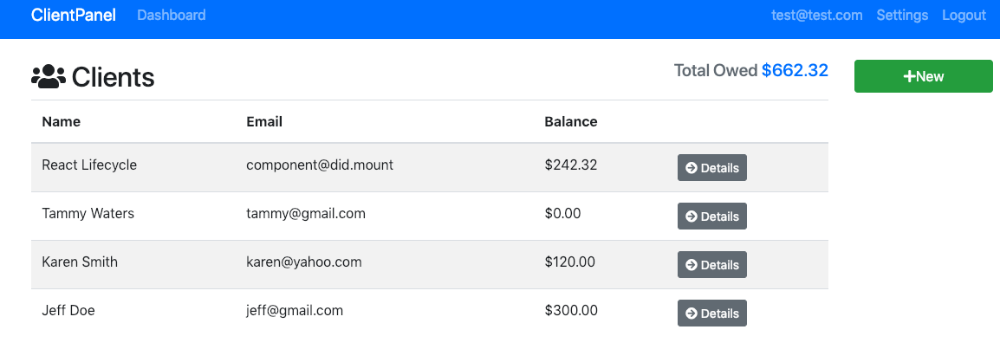

# Client Manager

https://reactproject-4f7cf.firebaseapp.com/

Client Manager is a web app I made to further my knowledge of React. It can be used to track clients and the balances they owe.

## Testing

For testing purposes, you can log in with the email 'test@test.com' and the password 'abc123'

## General Use

After logging in, the user may view clients already entered in the database. Client's names, emails, and balances owed are displayed alongside a details button. Clicking on the detials button displays all information tied to that client and allows for editing for deleting that client.

Users may add a new client by clicking the green 'New' button in the top right corner of the dashboard. Here users may enter client contact information and the balance they owe.

Settings for Client Manager may be accessed by the 'Settings' button in the navbar. There are three setting options that may be toggled, and their settings persist in local storage.

## Technologies used

Client Manager was made with React, Redux, and Firebase,
